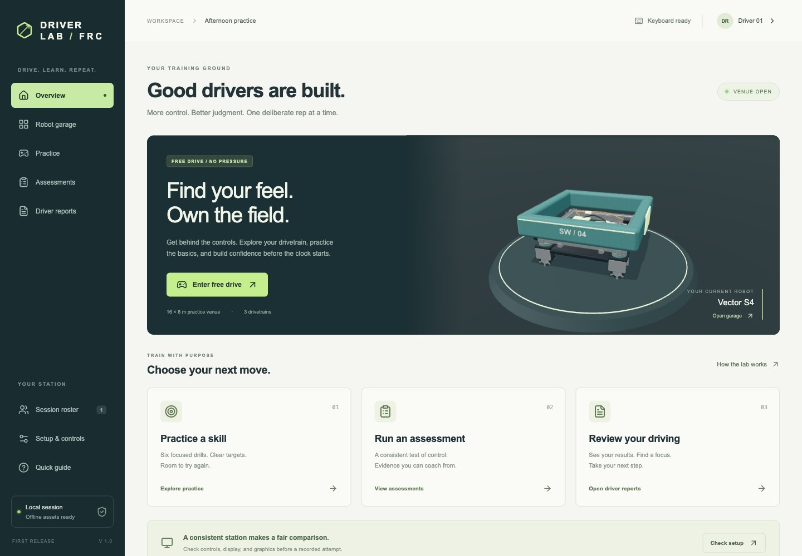

# FRC Driver Lab

A local desktop-browser robotics driving lab. Practice with four-module swerve, six-wheel differential, and four-wheel mecanum; run six structured assessments; rotate a driver roster; export printable reports.



[Robot garage](docs/images/garage.jpg) · [Practice venue](docs/images/venue.jpg) · [Robot detail](docs/images/robot-detail.jpg)

## Run locally

Install Node.js **22.12 or newer**. The reproducible toolchain uses **npm 11.11.0**.

```sh
npm ci
npm run dev
```

Open the localhost URL printed by Vite (normally **http://127.0.0.1:5173**). Chrome with WebGL 2 is the verified development browser; use a landscape window of at least 1280 × 720 for assessment. Localhost is a secure context for the Gamepad API. Press a button on a connected controller so the browser can discover it.

If npm 10 fails with an Arborist `edgesOut` error while resolving development peers, use `npx --yes npm@11.11.0 ci`. No paid service, application backend, account, or runtime AI is used.

## Production / offline

```sh
npm run build
npm run preview
```

The production site is written to `dist/`; preview normally runs at **http://127.0.0.1:4173**. Serve the entire folder over HTTPS or localhost. Opening `index.html` as a `file:` URL is not supported. Dependencies, WASM, procedural textures, fonts, and PDF generation run locally. After the first successful production load, the application service worker supports offline reload. Development mode intentionally does not cache assets.

Each production build has a source/dependency fingerprint, and each offline deployment has a content hash. Updates wait between sessions; a prior cached build can be restored from the cleared-session screen. See [offline delivery](docs/offline.md). Static hosting deployment itself is not part of the local launch; no hosting account is required.

## Use the lab

1. Choose a robot in **Robot garage**.
2. Open **Setup & controls**. Set input, calibration, mappings, deadzone, response, physical display context and any accommodation. **Run station check** selects the highest tested graphics tier that passes the short software check.
3. Drive freely for at least three minutes, then complete one unscored exposure to each skill. Additional practice is unlimited; comparative assessment after unequal exposure needs an explicitly named `Exposure override: reason` profile.
4. Choose **Screening** (one trial per skill) or **Full** (three trials per skill). Follow the published schedule. The first recorded attempt locks the comparison profile.
5. Review all attempts, raw metrics, score formulas and recorded paths. Add coach notes. Download individual/batch Letter or A4 PDFs or use **Print**.
6. Switch drivers in **Session roster**. Export reports, then **End session & clear** before leaving a shared computer.

Keyboard: **W/S** forward/back; **A/D** strafe for holonomic drives or steer differential; **Q/E** holonomic rotation; **Shift** precision; **Space** brake/swerve X-lock; **Escape** pause. Differential tank uses W/S for the left side and Up/Down for the right. All bindings are configurable. See the [coach/student guide](docs/coach-student-guide.md).

## Assessment and evidence boundaries

All robot presets are **generic and uncalibrated**. Rubrics are **provisional criterion scores**, not percentiles or validated driver-selection thresholds. Completed and DNF outcomes count; DNF scores zero. Technical invalidations have no score and permit one replacement per scheduled trial. Practice and missing results remain distinct. Screening omits the Core index and repeatability. Full assessment requires three scored outcomes in every skill under one matching profile.

The software implementation is complete against the documented first-release scope; **hardware and training-validation release gates remain open**: exact USB controllers on macOS/Windows, Windows visual/input testing, physical latency, measured real-robot calibration, long hardware soak, and coach/student pilot review. Do not present the simulator as qualified for driver selection until those checks are performed. See [validation results and limitations](docs/release-validation.md).

## Verify / maintain

```sh
npm run typecheck
npm test
npm run test:browser
npm run build
npm run format:check
```

Browser tests use installed Google Chrome, including actual keyboard driving, screening, invalidations, recovery, print and PDF download. `tests/feasibility.test.ts` drives all 18 robot/course combinations through the force model and runner. [Physics validation](docs/physics-validation.md) lists the measured fixture results and their limits.

- [Committed specification](docs/product-architecture-implementation.md) — preserved source of truth.
- [Architecture and implementation decisions](docs/implementation-notes.md).
- [Verification inventory](docs/verification-inventory.md).
- [Asset and dependency attribution](docs/asset-attribution.md).
- [Printable original specification](output/pdf/frc-driver-lab-specification.pdf).

The original specification PDF builder remains available: `python3 scripts/build_specification.py` with ReportLab and the documented macOS fonts. Application reports are generated separately in the browser with pdf-lib.
